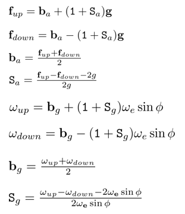

# Robotic perception SLAM course

Ville Lehtola, University of Twente, v.v.lehtola@utwente.nl   
2022-2024    
Credits to M. Affan and B. Ugudama.

This course repository is designed to introduce students to the fundamentals of SLAM (Simultaneous Localization and Mapping) through hands-on exercises. The course takes students from basic sensor integration to practical SLAM applications using modular exercises.

**Groupwork A**: Dead reckoning by IMU integration
- Objective: With the help of this group work, students will learn about estimating the movement of a perception head (here: a pedestrian) by integrating data that they have captured from an Inertial Measurement Unit (IMU). Students will learn about Euler angles and coordinate transformations, and to calculate position, velocity, and orientation by processing accelerometer and gyroscope data.
- Key Concepts:
  *  IMU calibration and data filtering (A1)
  *  Dealing with sensor noise and drift (A2)
  *  Coordinate transformations, including Euler angles, derivative of the rotation matrix, homogeneous coordinates (A2)
  *  Dead reckoning with IMU (A2)
  
  Practical Application: An IMU can always be used, regardless of the application or the environment (urban, rural, underwater, airborne, space), and is therefore a valuable sensor. This exercise is about pedestrian localization in an indoor environment (without GPS), which is crucial for applications in wearable technology and mobile robots. CBL students will relate this task to their robot design.

**Groupwork B**: 2D LIDAR-inertial SLAM with Cartographer
- Objective: Students will capture data with a 2D Hokuyo LIDAR sensor and implement a basic SLAM system using Cartographer, an open-source SLAM framework. The exercise focuses on building 2D maps of indoor environments by processing LIDAR scans.
- Key Concepts:
  * Lidar 2D scan matching
  * Pose estimation and map building
  * Local SLAM (=odometry) vs. global SLAM (=graphSLAM)
  * 2D Lidar-inertial SLAM with Cartographer
- Practical Application: This exercise allows building a 2D map of an indoor environment, which is useful in mobile robot navigation, autonomous vehicles, and drones.

**Groupwork C**: Multi-Sensor Data Fusion using A-LOAM 
- Objective: This exercise covers relatively advanced SLAM concepts, specifically registering data from two multi-line LIDAR sensors and performing advanced coordinate transformations. Students will explore cooperative sensor fusion and transform sensor data into a unified coordinate system.
- Key Concepts:
  * Cooperative sensor fusion for improved 3D map accuracy
  * Low level fusion vs. high level fusion
  * Registering and aligning data from different sensors
  * Handling big data from 3D multi-line lidars
- Practical Application: This exercise extends earlier SLAM implementation to multiple sensors, common in autonomous driving, drone exploration, 3D mapping, and robot localization.

## Prerequisite
 The following course repositories are recommended to run inside docker. With the help of docker, a pre-configured environment could be run without installing individual software dependencies, simplifying the overall process. The exercises are tested with the following versions:
 * Ubuntu Linux 20.04 (expected to work with Ubuntu Linux 22.04)
 * Docker 26.0.00 (expected to work with other versions as well)
 * MESA (`conda install -c conda-forge libglu` (if using conda) OR `sudo apt-get install libgl1-mesa-glx libgl1-mesa-dri` (if using sudo env)
 * MT Manager (For preferred OS, Refer this [link](https://www.movella.com/support/software-documentation))
 * Python, MATLAB, or any other programming language with visualization packages

Installing ROS is not necessary.

## Setup Instructions
### 1. Clone the Repository
```
git clone --recurse-submodules https://github.com/vlehtola/slam-course.git
cd slam-course
```
### 2. Get sensor data

**For exercise A1:** The IMU data recording will be demonstrated in class. Basically, IMU will be connected the computer and MT Manager Interface will be used to record data.
With MT Manager, the recorded data is automatically stored as a MT Binary Logfile (.mtb) file. It needs to be opened and exported to .txt (or any other prefered format) to be used with programming environment.
The stored data (.txt) file will be utilized later by analyse_data.py program in `RPCN_PART_A1` folder


  
**For exercises A2 & B:** Download the `rosbag` files (sensor data) from [here (these are available once you have captured the data)](https://surfdrive.surf.nl/files/index.php/s/cKCFQRLSTa5dfBF) and place these inside the slam-course folder named `bagfiles`. The downloaded bag files could be organized inside in a slam-course folder as shown below (it is completely fine to organize differently as well, but then the `path` to bag files would need to be readjusted)


**For exercise C:** We won't use the backpack data in this exercise. We will use NTU VIRAL DATASET for the given exercise.
	First, download the data [nya_01 (Collected inside the Nanyang Auditorium)](https://researchdata.ntu.edu.sg/api/access/datafile/68144) from here or directly from the website, unzip 	it, and place it in the `slam-course/bagfiles` folder. You can download the rosbag via a Linux terminal with the following commands.
```	            
wget <bag zipfile URL>
unzip <downloaded bag zipfile #(e.g., 68144> -d <bagfile folder>)
unzip nya_01 #To get the rosbag and related config files
```     

### 4. Compute the scale and Bias factor of IMU (for excercise A1 and A2)
- Modify the path in the `analyse_data.py` code in the `RPCN_PART_A1` folder to load IMU stored data (.txt or any other format saved) and compute average F_up and F_down. Make any necessary changes based on the number of files or their format. Remember to use .txt imu data files in pairs (e.g., 1 with 2, 3 with 4; if alternate axes are saved similarly). Refer `Assignment.md` document for more details.
- Now, the average values obtained from earlier activities will be used. Use the following equations to find bias and scale factors (You may have to neglect some terms).



- When you have bias and scale factors, utilize the formulae given in lecture slides for accelerometer and angular rate errors. For more details, refer to the `Assignment.md` file in `RPCN_PART_A1` folder.


### 5. Build the Docker Image [note: use sudo or make a docker group]
Each group exercise has a separate docker file. For any given exercise, go to the respective folder, build the corresponding docker via the following commands,

- #### For exercise A2
```
cd RPCN_PART_A2
sudo docker build . -t rpcna  #rpcna is the docker image name for exercise A  
```
- #### For exercise B
```
cd RPCN_PART_B
sudo docker build . -t rpcnb  #rpcnb is the docker image name for exercise B  
```
- #### For exercise C
```
cd RPCN_PART_C
make build  #rpcnc is the docker image name for exercise C  (Makefile builds the container here)
```
 
### 6. Start the Docker container
   
While inside any exercise folder (e.g., RPCN_PART_A2) 
     ```
     ./run_docker.sh 
     ```
If you see the following outcome (or similar), you are successfully inside a docker container
     


- #### For exercise A2 
	a. Check if you have your datasets(.bag) in the container
	
		cd backpack/bagfiles/
		ls

	
	           
	b. To playback rosbag, you need to source ROS with the following command and start ROS
	   
		source /opt/ros/noetic/setup.bash
		roscore 	#May not be necessary e.g. if roscore or any other ros package is running
	
	
	**PS: You must source whenever you open a new terminal and connect it with docker**
	           
	c. Now open two new terminals and connect them to the running container as follows:
	       	   
		docker ps
		xhost +local:docker
		docker exec -it <id> bash
	           
	
	
	Note: `<id>` refers to the container ID shown beside the container name (e.g., here 572aa1996226)


  	d. While in a newly open container terminal (one of two newly open terminals), go to `backpack/bagfiles/` and play one of the rosbags

		cd backpack/bagfiles/
		rosbag play <xx.bag> --clock
   
	e. Go to another newly open container terminal and look for rostopics as follows

		rostopic list #Shows all the published rostopics
		rostopic echo <topicname> #shows data of specific rostopic <topicname>
		rostopic echo /imu/data > ascii_file.txt #Extract the topic data to a text file
		rostopic echo /imu/acceleration | grep x > ascii_x_acc.txt #This saves only the x-axis acceleration data into the file

	f. Use the above commands to save IMU data; this will be used to interpolate a trajectory (See the assignment document for more description).

- #### For exercise B
   	a. Check if you have your datasets(.bag) in the container
   
		cd backpack/bagfiles/
		ls

   
	b. Now open two new terminals and connect them to the running container as follows:
	   
	       	   
		docker ps
		xhost +local:docker
		docker exec -it <id> bash
   
	c. Go to the newly open container terminal, and run cartographer
            
		source "/opt/ros/${ROS_DISTRO}/setup.bash"
		cd /home/rpcn/catkin_ws
		source "/opt/cartographer_ros/setup.bash"
		source devel/setup.bash
		roslaunch rpcn_part_b rpcn_part_b.launch bag_filename:=/home/rpcn/catkin_ws/src/rpcn_part_b/bagfiles/{your_bag_file_name}

	d. You'll need to understand the cartographer's configuration to complete your assignment in the my_robot.lua file.
        Use your preferred text editor to view and edit the config file, which is placed inside the following location
	       `/home/rpcn/catkin_ws/src/rpcn_part_b/configuration_files/my_robot.lua`
   
	e.  Edit the my_robot.lua file to enhance the performance of the cartographer SLAM algorithm.
   You'll need to discuss and plot results. (Please see the assignment document for more details.)

- #### For exercise C
   
	a. Visualize the ros topics in rviz window

	b. If you wish to directly interact with rostopics, go to the separate terminal and link it with `rpcnc` running container via `docker exec -it <id> bash`

	c. Exit the container when finished, and write `make clean` while inside folder `RPCN_PART_C` to delete the container

	d. Refer to the assignment section for more details

TO DO:
	1. Add an evaluation scheme for assignment 3. That is, comparison of detoriated trajectory with the reference benchmarked provided by the NTUVIRAL dataset


### 7. Cross-check if the environment is closed
```
docker ps
```

